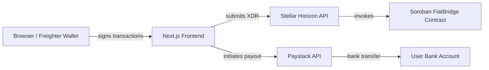

# Dechat - AI-Powered Asset to Fiat Bridge on Stellar

A decentralized exchange (DEX) interface prioritizing seamless asset-to-bank conversions leveraging AI-assisted conversations and automated Soroban smart contracts on the Stellar network.


## Overview

Dechat connects natural AI conversation flows with Stellar's fast blockchain technology to create an intuitive platform for cryptocurrency to fiat conversions. Users interact with an AI assistant that securely triggers smart contract interactions (utilizing Soroban) directly from the chat UI.

### Key Features

- **AI-Powered Interface**: Intelligent conversation flow with an AI assistant
- **Fiat Offramp**: Seamless conversions governed by Soroban smart contracts
- **Real Bank Integration**: Verification capabilities suited for fiat channels
- **Mobile-Responsive Design**: Optimized for all device sizes
- **Stellar Wallet Integration**: Connect via Freighter natively
- **Real-time Portfolio**: Live balance queries through the Stellar network

## Architecture

The application is split into a **Soroban smart contract** that holds escrow funds on Stellar and a **Next.js frontend** that ties the user's browser, an AI assistant, the Stellar network, and a fiat payout provider together.



### Directory Overview

| Directory | Description |
|-----------|-------------|
| `stellar-contracts/` | Soroban smart contract (Rust) — escrow deposits, tiered withdrawals, oracle pricing, fee accrual |
| `dex_with_fiat_frontend/` | Next.js 15 app — AI chat UI, wallet connection, fiat offramp pages, admin dashboard |
| `scripts/` | Python helper scripts for GitHub issue management and test utilities |

### Component Details

#### 1. Smart Contract (`/stellar-contracts`)
- **Blockchain**: Stellar (Soroban)
- **Main Contract**: `FiatBridge` — escrow deposits, risk-tiered withdrawal queue, oracle price validation, slippage protection, multi-token support
- **Language**: Rust
- **Framework**: Soroban SDK 25.3.0

##### On-chain operational metrics (read-only)

The `FiatBridge` contract exposes read-only views intended for operational dashboards.

- `get_accrued_fees(token: Address) -> i128`
  Returns the total amount of fees currently accrued for the specified token that have not yet been withdrawn by the administrator.

- `get_wq_depth() -> u64`
  Returns the current number of withdrawal requests present in the withdrawal request queue.

- `get_wq_oldest_queued_ledger() -> Option<u32>`
  Returns the ledger sequence when the oldest currently-pending withdrawal request was queued.
  Returns `None` when the queue is empty.

- `get_wq_oldest_age_ledgers() -> Option<u32>`
  Returns the age of the oldest currently-pending withdrawal request in units of ledgers, computed as:
  `current_ledger_sequence - oldest_queued_ledger`.
  Returns `None` when the queue is empty.

#### 2. Frontend Application (`/dex_with_fiat_frontend`)
- **Framework**: Next.js 15 with TypeScript
- **Styling**: Tailwind CSS
- **Blockchain Integration**: `@stellar/stellar-sdk` and `@stellar/freighter-api`
- **Wallet Connection**: Freighter extension integration
- **AI Integration**: Google Generative AI assistant
- **Fiat Payout**: Paystack API (Nigerian bank transfers)

### 4. Admin Authentication Architecture
The admin dashboard and administrative actions rely on an on-chain root of trust. The `AdminGuard` component in the Next.js app fetches the configured admin address directly from the smart contract using `getAdmin()`. All administrative write operations require cryptographic signatures matching this address, ensuring front-end role spoofing is impossible. For a detailed architectural breakdown, see the [FiatBridge Contract README](stellar-contracts/FIAT_BRIDGE_README.md#admin-authentication-architecture).

## Tech Stack

| Layer | Technology | Purpose |
|-------|-----------|---------|
| Smart Contracts | Rust + Soroban SDK 25.3.0 | On-chain escrow, withdrawal queue, fee management |
| Frontend Framework | Next.js 15.3.5 (React 19) | App Router, API routes, SSR |
| Language | TypeScript 5 | Type-safe frontend development |
| Styling | Tailwind CSS 4 + Framer Motion | UI styling and animations |
| Blockchain SDK | @stellar/stellar-sdk 14.6.1 | Stellar network interaction |
| Wallet | @stellar/freighter-api 6.0.1 | Browser wallet connection |
| Fiat Payout | Paystack API | Bank verification, transfers (Nigeria) |
| AI Assistant | Google Generative AI | Chat-driven transaction flow |
| Testing | Vitest + Playwright (frontend), cargo test (contracts) | Unit and E2E tests |
| Code Quality | Husky + lint-staged, ESLint, Clippy | Pre-commit hooks |

## How It Works

DEX-CHAT converts crypto to fiat through an AI-guided conversation flow. The end-to-end process follows three stages:

### 1. Deposit (crypto into escrow)

The user connects their Freighter wallet and tells the AI assistant they want to offramp a token amount. The frontend builds a Soroban `deposit` transaction that transfers the specified token from the user's Stellar account into the `FiatBridge` contract. The contract validates the deposit against oracle-sourced prices, enforces slippage limits, checks per-token and daily deposit caps, and records a `Receipt` with a unique memo hash.

For maintainers: how slippage BPS and the on-chain threshold interact is documented in [docs/slippage-threshold.md](docs/slippage-threshold.md).

### 2. Escrow (on-chain hold)

Deposited funds are held in the smart contract's escrow. A withdrawal request is queued with a risk tier that determines the timelock duration — higher-value or higher-risk withdrawals wait longer before they can be executed. During this period the admin dashboard provides real-time metrics (queue depth, oldest request age, accrued fees) so operators can monitor the pipeline.

### 3. Fiat Payout (bank transfer)

Once the withdrawal clears its timelock, the frontend's API routes coordinate the fiat leg through Paystack:

1. **Verify** the user's bank account (`/api/verify-account`)
2. **Create** a transfer recipient (`/api/create-recipient`)
3. **Initiate** the bank transfer (`/api/initiate-transfer`)
4. **Poll** transfer status until settlement (`/api/transfer-status`)

The user sees a real-time transfer timeline in the chat interface and can download a PDF receipt when the payout completes.

## 📋 Prerequisites

Before you begin, ensure you have the following installed:

- **Node.js** (v18 or higher)
- **npm** or **yarn**
- **Rust** & Cargo tooling + `wasm32-unknown-unknown` target
- **Stellar CLI** (for interacting with Soroban)
- **Docker** & **Docker Compose** (optional, for quick start)

## Quick Start with Docker

The fastest way to get the full stack running locally is with Docker Compose. This boots the frontend and a local Soroban network with no manual setup required.

### Prerequisites
- Docker Desktop or Docker Engine + Docker Compose
- No need to install Node.js, Rust, or Stellar CLI manually

### Steps

```bash
# 1. Clone the repository
git clone https://github.com/leojay-net/DEX-CHAT.git
cd DEX-CHAT

# 2. Copy the Docker environment file
cp .env.docker dex_with_fiat_frontend/.env.local

# 3. Start the full stack
docker compose up

# The services will be available at:
# - Frontend: http://localhost:3000
# - Soroban RPC: http://localhost:8000/soroban/rpc
# - Horizon API: http://localhost:8000
```

### What's Included

- **soroban-local-net**: Stellar quickstart image running a standalone Soroban network
- **frontend**: Next.js development server with hot reload
- **Pre-configured networking**: Services can communicate with each other

### Stopping the Stack

```bash
# Stop and remove containers
docker compose down

# Stop and remove containers + volumes (clean slate)
docker compose down -v
```

## Installation & Setup (Manual)

If you prefer to run services individually or need more control:

### 1. Clone the Repository

```bash
git clone https://github.com/leojay-net/Dechat.git
cd Dechat
```

### 2. Smart Contract Setup

```bash
cd stellar-contracts

# Build the smart contracts
cargo build --target wasm32-unknown-unknown --release

# Run tests
cargo test
```

### 3. Frontend Setup

```bash
cd dex_with_fiat_frontend

# Install dependencies needed for Stellar connection
npm install

# Start the development server
npm run dev
```

### 4. Git Pre-commit Hooks (Husky + lint-staged)

This repository uses Husky and lint-staged to run quick quality checks before each commit.

```bash
# from repository root
npm install
npm run prepare

# required once for Rust linting
rustup component add clippy
```

What runs on pre-commit:

- Staged Rust files in `stellar-contracts/**/*.rs`: `cargo clippy --all-targets --all-features -- -D warnings`
- Staged TypeScript files in `dex_with_fiat_frontend/**/*.{ts,tsx}`: `eslint --max-warnings=0` on staged files only

You can also run the same checks manually:

```bash
npm run precommit:clippy
npm run precommit:eslint
```

## Documentation

- **[TypeScript SDK Examples](docs/typescript-sdk-examples.md)** - Complete guide for calling new contract functions (`heartbeat`, `deny_address`, `migrate_escrow`, `execute_batch_admin`) from the TypeScript SDK with error handling patterns and code examples.

## Contributing!!
Contributions and feature reviews are welcome. Please open up an issue to raise bugs or feature requests!
